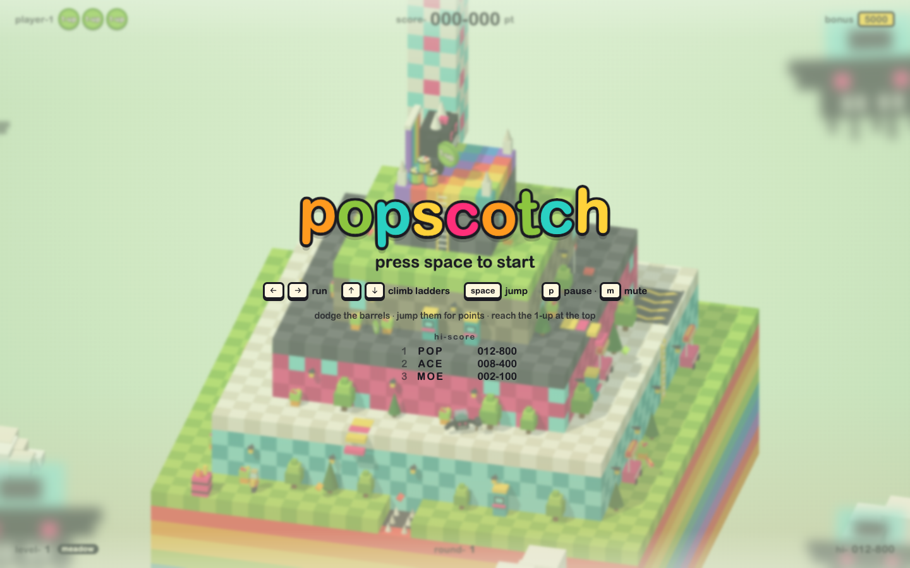
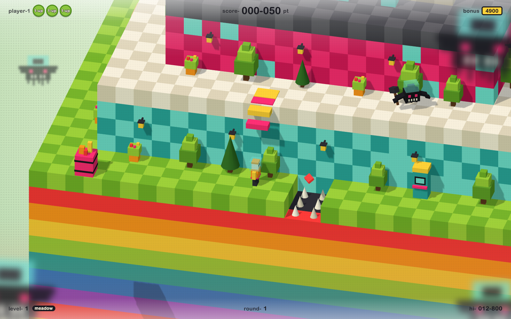
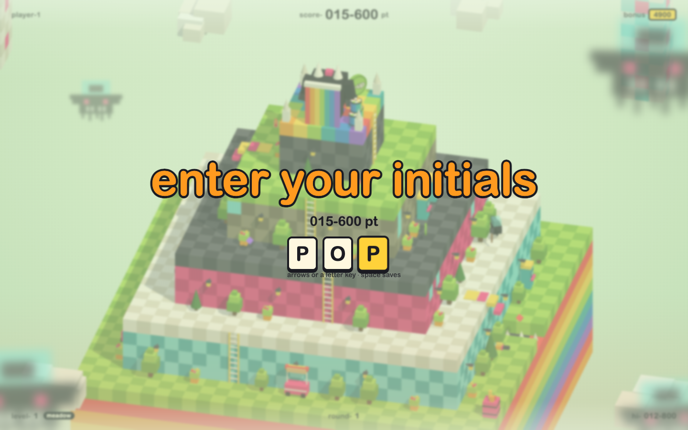

# Popscotch

A voxel arcade climber played around four-sided stepped pyramids. Jump the barrels,
climb the ladders, and put three initials on the high-score table.

**[Play it in the browser](https://popscotch.fun)**



Popscotch is an original game in the spirit of the barrel-jumping arcade cabinets.
Nothing here is pulled from those games: the voxels, textures, sound effects, and music
are generated in code when the page loads. There is no asset folder and no backend.

## How to play

Each tier of the pyramid has a terrace ring around all four sides. Left and right walk
the ring (right is clockwise as seen from outside, so the controls never flip) and the
camera shows one face at a time. Walk around a corner and the view snaps a quarter turn.
The world freezes for that moment. Ladders on the tier walls lead up to the summit, where
the green **1-up** coin waits.

The monster on the summit lobs barrels onto the top ring. They roll either way (often
switching direction after a drop), tumble off striped chutes, sometimes take a ladder,
fall into open pits, and end in the pink drum, which spits out a wandering flame. Jump a
barrel for 100 points. Ghosts patrol the rings. Gems (50), hot dogs (300), and a 1-up
are scattered around. Letting the bonus timer hit zero costs a life.

A bouncy synth loop plays while you climb. It speeds up on later loops and jumps an
octave while you hold the hammer.



### Controls

| Key | Action |
| --- | --- |
| ← → | run |
| ↑ ↓ | climb ladders |
| Space | jump, start, or save initials |
| P / Esc | pause |
| M | mute |

### High scores

A score that cracks the top 10 asks for three initials before the table is shown. Arrow
keys or a letter key pick them, and space saves. The list stays in this browser, under
the `localStorage` key `popscotch.hiscores`.



### Levels

Three hand-made levels play in order, then loop faster with more ghosts. The HUD shows
the current level and its name. Time of day moves on every round (day, dusk, night) and
shifts each lap, so a level looks different each time it comes around. Dusk and night
bring lower light, stars, and glowing windows, lanterns, and balloons.

| Level | Shape | Route | Features |
| --- | --- | --- | --- |
| meadow | 4 tall tiers | spirals right | spike pit, conveyor, switch gate, hammer |
| candy hills | 5 tiers | spirals left | crumbling floors, moving platform, pits, key door |
| desert arcade | 6 short tiers | zig-zags each ring | everything, 3 flames |

### Obstacles

- **Spike pits.** Gaps in the walkway. Jump them. Barrels that roll in are destroyed.
- **Crumbling tiles.** They shake, then drop away a moment after you step on them. They reset when you lose a life.
- **Moving platforms.** They slide across pits too wide to jump. Stand still and ride.
- **Conveyors.** They push you along the ring, with you or against you.
- **Switch gates.** A red gate blocks a ladder until you step on its red-flag switch.
- **Key doors.** A pink door blocks a ladder until you pick up the key somewhere on the level.
- **Hammer.** Smash barrels (300), flames (500), and ghosts (500) for 9 seconds. You can't climb while holding it.
- **Flames.** Born when a barrel hits the drum. They wander the rings and use ladders.

## Develop

Node.js **20.19 or newer**, or **22.12 or newer**. Vite 8 will not start on older 20.x releases.

```bash
npm install
npm run dev         # http://localhost:5173
npm run check:levels
npm run build       # type-checks, then writes a static site to dist/
npm run preview
```

`dist/` is a static bundle. Textures and sound are generated at runtime, so there is
nothing else to host. The only persisted data is the high-score table in `localStorage`.

`Dockerfile` builds that site and serves it. Any static host works the same way.

## Structure

```
src/
  main.ts            boot + frame loop
  game.ts            state machine, level loading, scoring, collisions
  hiscore.ts         top-10 table and three-letter names
  level.ts           pyramid geometry and ring coordinates from a level definition
  levels/types.ts    level definition format (plain JSON-friendly data)
  levels/defs.ts     the three hand-made levels
  levels/skins.ts    per-level look: tier colours, decor mix, background palette
  levels/validate.ts sanity checks for level definitions (bounds, overlaps, locks)
  timeOfDay.ts       day / dusk / night lighting, and which round gets which
  obstacles.ts       crumbling tiles, moving platforms, conveyors, gates, doors
  world.ts           static voxel pyramid baked into instanced meshes (rebuilt per level)
  background.ts      3D background: towers, clouds, islands, balloons, flying critters
  stage.ts           renderer, lights, orbiting orthographic camera
  config.ts          palette and tuning (physics, barrels, fire, hammer, camera)
  entities/          player, boss, barrels, ghosts, fire, items, token, particles
  hud.ts             DOM HUD, banners, overlays, score popups
  backdrop.ts        blurred poster ghosts layered in front of and behind the canvas
  audio.ts           synthesized sound effects and the shared WebAudio bus
  music.ts           original synth loop, sequenced in code
  input.ts textures.ts voxel.ts utils.ts
scripts/
  validate-levels.ts  runs validateLevel on every level
  sim-routes.ts       bot walks each level's intended route with real physics
```

In dev builds the running game is exposed as `window.__game`, and level problems are
logged to the console.

## Authoring levels

Levels live in `src/levels/defs.ts` as plain data (`LevelDef`). Spots are
`{ ring, side, offset }`: side 0..3 is the south, east, north, and west face, and offset
is measured from the middle of that side. Spans (pits, crumbles, conveyors, platform gaps)
are centred on `offset`, and their edges must land on whole numbers so they line up with
the voxel grid.

```bash
npm run check:levels   # validate every level and prove its route can reach the summit
```

When you add a level, add its route to `scripts/sim-routes.ts`. Anything loaded from
outside the bundle has to pass `validateLevel` before it is built. That check caps sizes
and counts.

## License

[MIT](LICENSE) © Thomas Petersen
